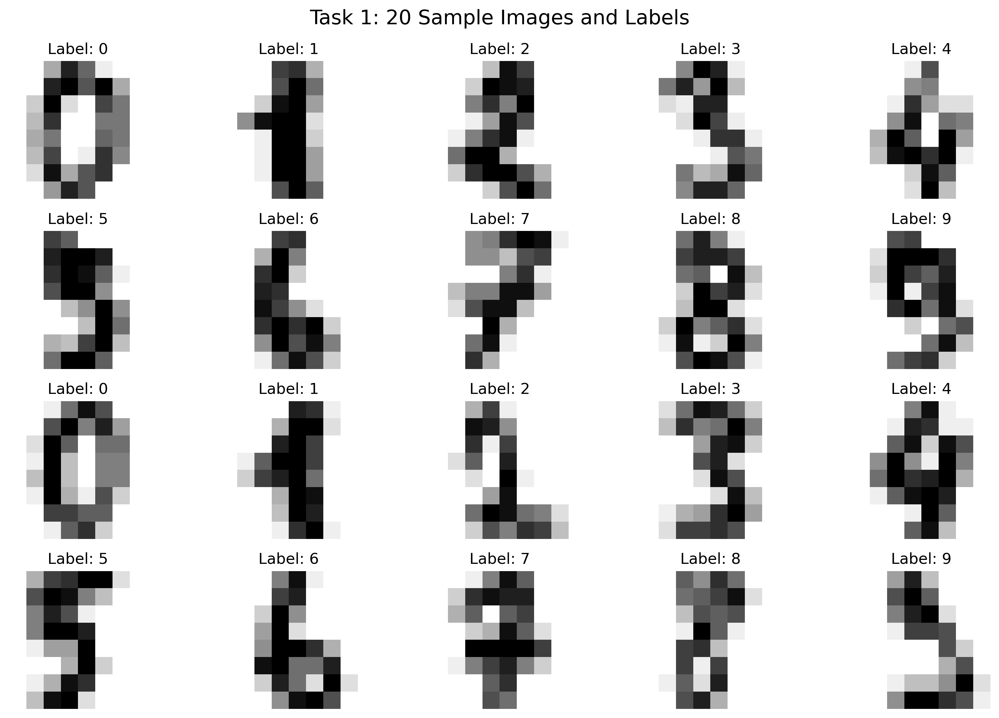
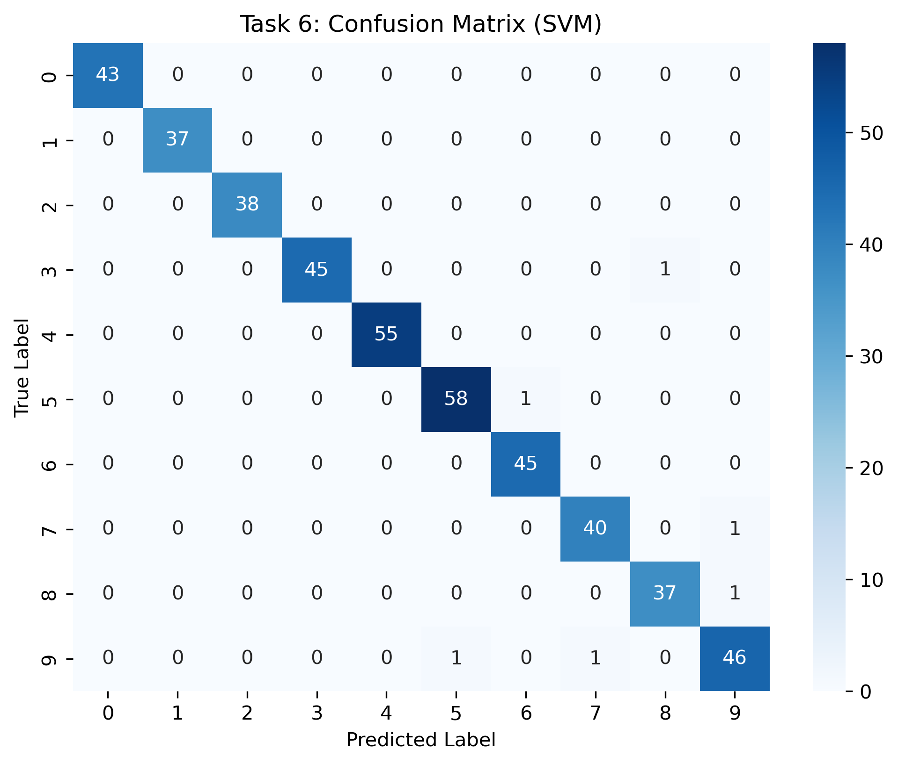
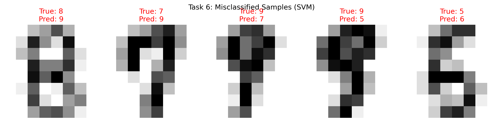

# Traditional ML Handwritten Digits Classifier

An end-to-end computer vision and machine learning experiment that evaluates the performance of six traditional classification algorithms on handwritten digit images.

## 📖 Overview

This project demonstrates the complete pipeline of handling image data with traditional machine learning methods. Using the `sklearn` digits dataset (8x8 grayscale images), we flatten the 2D image matrices into 64-dimensional feature vectors. The experiment trains, evaluates, and compares six classic classifiers, followed by an in-depth error analysis using a confusion matrix.

**Key Learnings & Objectives:**
- Understanding the difference between training sets and testing sets (75/25 split).
- Feature representation: transforming spatial image data into structured 1D vectors.
- Comparing model performances and understanding their underlying algorithms.
- Analyzing misclassifications and the limitations of raw pixel features (lack of spatial invariance).

## 🛠️ Tech Stack

- **Language:** Python 3.x
- **Core ML Library:** `scikit-learn`
- **Data Manipulation:** `NumPy`
- **Data Visualization:** `Matplotlib`, `Seaborn`

## 📊 Dataset: sklearn digits
- **Image Size:** 8 x 8 pixels
- **Total Samples:** 1,797
- **Classes:** 10 (Digits 0 through 9)
- **Feature Vector:** 64 dimensions per image

> **Sample Images:**
> *(Ensure `task1_samples.png` is uploaded to your repository)*
> 
> 

## 🚀 Models Evaluated & Results

We evaluated six models based on their accuracy on a 450-sample test set (25% split, random_state=42).

| Model | Classification Strategy | Test Accuracy |
| :--- | :--- | :--- |
| **KNN (K-Nearest Neighbors)** | Distance-based voting | **0.9933** 🏆 |
| **SVM (Support Vector Machine)** | Maximum margin hyperplane | **0.9867** 🥈 |
| **Logistic Regression** | Linear probability boundary | 0.9733 |
| **Random Forest** | Ensemble decision trees | 0.9711 |
| **Decision Tree** | Feature threshold splitting | 0.8578 |
| **Naive Bayes** | Probability with feature independence | 0.8556 |

**Summary:** Models that calculate spatial distance (KNN) or map high-dimensional non-linear boundaries (SVM with RBF kernel) performed exceptionally well on these centered, low-resolution images. Conversely, Naive Bayes performed the worst because its core assumption—that features (pixels) are completely independent—strictly violates the strong local correlation of strokes in image data.

## 🔍 Error Analysis (SVM)

Even the highly accurate SVM model misclassified 6 out of 450 test samples. 

> **Confusion Matrix:**
> *(Ensure `task6_confusion_matrix.png` is uploaded to your repository)*
> 
> 

> **Misclassified Samples:**
> *(Ensure `task6_errors.png` is uploaded to your repository)*
> 
> 

**Observations:**
Errors primarily occurred between topologically similar digits at this extreme low resolution (e.g., `3` vs. `8`, `7` vs. `9`). Minor variations in handwriting, such as connected loops or ink smudges, easily push the raw pixel feature vector across the SVM decision boundary.
